# Curso AWS Data Analytics for IoT

## Índice
- [Visão geral do curso](#conhecendo-curso)
- [Quais as soluções AWS estudadas e o que cada uma atende?](#solucoes-estudadas)
- [Explique três exemplos de atividades que você realizou no laboratório prático](#atividades-laboratorio-pratico)
- [Quais as principais lições apreendidas do curso?](#licoes-curso)

# [Visão geral do curso](#conhecendo-curso)

O curso **Data Analytics** fornecido pela *AWS Academy* é focado no desenvolvimento das habilidade necessárias para análise de dados e big data utilizando as ferramentas e serviços fornecidos pela AWS.

O curso é subdivivido em nove laboratórios. O foco dos laboratórios está no desenvolvimento do conhecimento relacionado a utilização do conjunto de ferramentas da AWS. 

# [Quais as soluções AWS estudadas e o que cada uma atende?](#solucoes-estudadas)

O desenvolvimento dos oito laboratórios envolveu a utilização de sete soluções oferecidas pela AWS com foco no processamento de dados para IoT. 

Entre as muitas soluções disponibilizadas pela AWS, foram exploradas: 1) Amazon Athena, 2)Amazon Redshift, 3)Amazon S3, 4)AWS Glue, 5)AWS IoT Analytics e 6)Amazon Kinesis Data Firehose e 7) Amazon Elasticsearch Service (Amazon ES).

No contexto de soluções, as ferramentas oferecidas pela AWS podem se confundir e por isso explicarei de forma individual o que cada uma delas atende.

**1. Amazon Athena**

Amazon Athena é um serviço de análise interativo que permite consultar e analisar dados armazenados no Amazon S3 usando SQL padrão. Ele foi projetado para tornar a análise de dados mais rápida, simples e escalável, sem a necessidade de configurar e gerenciar um banco de dados ou infraestrutura complexa. Ele pode ser utilizado para analisar tanto dados não estruturados como dados semiestruturados armazenados no S3.

**2. Amazon Redshift**

O **Amazon Redshift** é um serviço de *data warehouse* totalmente gerenciável, o que significa que foi projetado para assumir todas as tarefas e responsabilidades operacionais sem a necessidade de intervenção direta do usuário. Isso permite que os usuários se concentrem exclusivamente na análise de dados, sem se preocupar com a complexidade da infraestrutura subjacente. Sua principal aplicação é realizar análises e consultas em grandes volumes de dados. Ele é especialmente útil para empresas e organizações que precisam analisar dados estruturados em busca de insights valiosos. Através do Redshift, os usuários podem executar consultas complexas em tempo hábil, permitindo a extração de informações importantes para tomada de decisões estratégicas.

Uma das características distintivas do Amazon Redshift é sua arquitetura de banco de dados colunar, essa abordagem permite que o Redshift processe consultas analíticas e agregações rapidamente, tornando-o uma escolha ideal para analisar grandes volumes de dados de maneira eficiente. Além disso ele é totalmente escalável, o que significa que pode crescer de acordo com as necessidades das empresas, acomodando volumes de dados em constante expansão. Sua integração com outras ferramentas da AWS e compatibilidade com diversas aplicações de Business Intelligence (BI) facilitam a visualização e comunicação dos resultados da análise.

**3. Amazon S3**

O **Amazon S3** (Simple Storage Service) é um serviço de armazenamento de objetos altamente escalável e durável.Ele foi criado para armazenar e recuperar grandes quantidades de dados de forma segura e eficiente. Entre as ferramentas disponibilizadas para armazenamento de dados em nuvem, o S3 é uma das opções mais populares devido à sua confiabilidade, acessibilidade e facilidade de uso.

No S3, os dados são armazenados em "objetos", que podem ser qualquer tipo de arquivo digital, como imagens, vídeos, áudios, documentos de texto e muito mais. Cada objeto é identificado por uma chave única e pode ser acessado através de URLs (Uniform Resource Locators) específicos fornecidos pelo serviço.

**4. AWS Glue**

O **AWS Glue** é um serviço de ETL (Extract, Transform, Load). O ETL é um processo essencial no contexto de análise de dados, que envolve a extração de dados de várias fontes, sua transformação para um formato adequado e a carga dos dados em um destino, como um *data warehouse* ou *data lake*, para fins de análise e tratamento.

O principal objetivo do AWS Glue é simplificar e automatizar o processo de ETL. Ele oferece uma plataforma para a criação, execução e agendamento de fluxos de trabalho ETL sem a necessidade de configurar ou gerenciar a infraestrutura subjacente. Isso permite que os usuários se concentrem na lógica de transformação dos dados, em vez de se preocuparem com a complexidade do ambiente de ETL.

**5. AWS IoT Analytics**

O AWS IoT Analytics é um serviço que permite a análise de dados coletados de dispositivos como sensores, medidores e máquinas, que além de estar conectados à internet também podem coletar e transmitir dados.

O AWS IoT Analytics facilita a ingestão, processamento, armazenamento e análise de grandes volumes de dados gerados por esses dispositivos IoT. Ele fornece uma plataforma escalável para processar e obter *insights* significativos desses dados, permitindo que as decisões sejam realizadas com base nas informações coletadas.

**6. Amazon Kinesis Data Firehose**

O **Amazon Kinesis Data Firehose** é um serviço que permite a captura, transformação e carregamento de dados de *streaming* em tempo real para armazenamento e análise. Ele faz parte da família de serviços do Amazon Kinesis, que é projetada para lidar com dados em *streaming* de maneira escalável e eficiente.

O Kinesis Data Firehose é principalmente utilizado para coletar e processar grandes volumes de dados em tempo real, vindos de várias fontes, como dispositivos IoT, logs de aplicativos, eventos de sites, feeds de redes sociais, entre outros. O serviço facilita a entrega desses dados de *streaming* para destinos como o Amazon S3, o Amazon Redshift, o Amazon Elasticsearch ou até mesmo para a análise em tempo real com o Amazon Kinesis Data Analytics.

**7. Amazon Elasticsearch Service**

O **Amazon Elasticsearch Service** é um serviço que permite criar, executar e escalar *clusters* Elasticsearch de maneira fácil e eficiente. O Elasticsearch é uma poderosa ferramenta de busca e análise de dados em tempo real, amplamente utilizada para indexar, pesquisar e visualizar grandes volumes de dados não estruturados.

Utilizando o Elasticsearch Service, os usuários podem implantar e configurar *clusters* Elasticsearch sem a necessidade de gerenciar a infraestrutura subjacente como provisionamento de servidores, ajuste de desempenho, aplicação de *patches* e *backups*. Sua implantação permite que os usuários se concentrem na análise de dados em vez de tarefas de gerenciamento de infraestrutura.

**8. Identity and Access Management - IAM**

O IAM (Identity and Access Management) é um serviço presenta na Amazon Web Services (AWS) que permite gerenciar o acesso aos recursos e serviços da AWS de forma segura. Com esse serviço é possível criar e gerenciar identidades (como usuários, grupos e funções) e definir permissões e políticas para controlar o que essas identidades podem fazer nos demais serviços da AWS.

A utilização do IAM é altamente recomendável e até mesmo considerada fundamental para garantir a segurança dos recursos da AWS e para cumprir práticas recomendadas de segurança, como a separação de funções e o controle granular de permissões.

# [Explique três exemplos de atividades que você realizou no laboratório prático](#atividades-laboratorio-pratico)

### Lab 1: Store data in Amazon S3

**Serviços Utilizados**: Access Amazon S3, IAM

**Objetivo**: Acessar o Amazon Redshift via Console de Gerenciamento da AWS, criar um cluster, carregar e consutlar dados do S3 para o Redshift.

**Atividades realizadas**:

1. Criando um usuário e adicionando ele no grupo

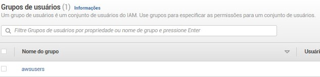           
            

2. Criando um bucket e carregando um arquivo não comprimido e comprimido

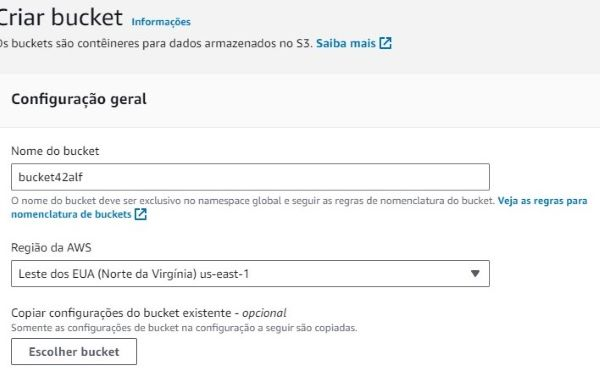         
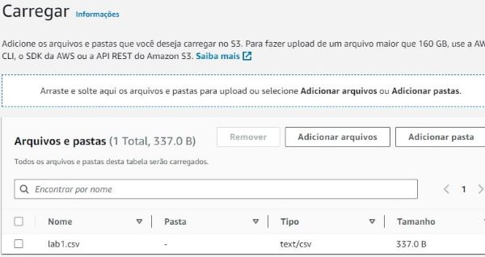   

3. Realizando uma consulta para confirmar que o arquivo foi carregado

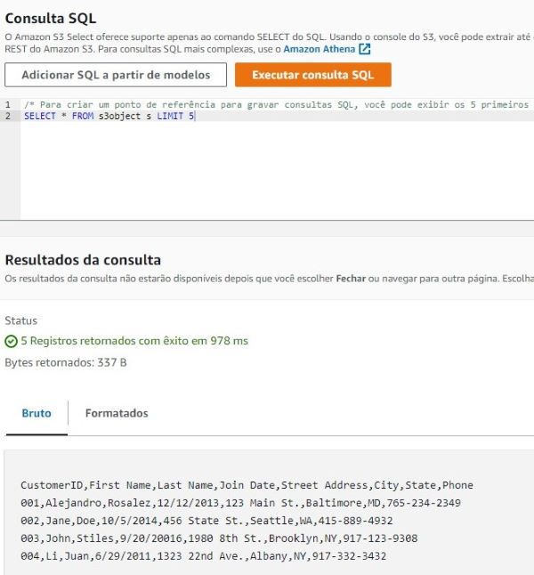 

4. Mudando as propriedades de encriptação  

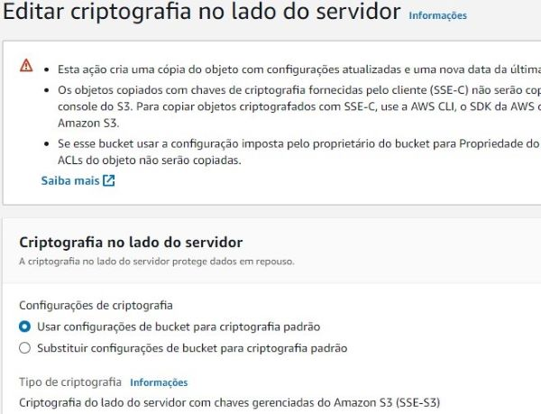 

5. Carregando um arquivo não comprimido e comprimido e confirmando seu carregamento 

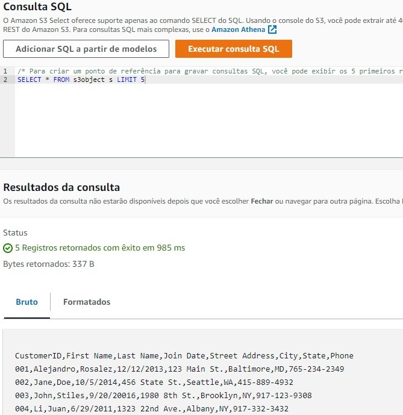 

### Lab 2: Query Data in Amazon Athena

**Serviços Utilizados**: Amazon Athena, S3

**Objetivo**: Acessar o Amazon Athena via Console de Gerenciamento da AWS, criar um banco de dados no Athena, criar uma tabela no Athena e otimizar um banco de dados Athena.

**Atividades realizadas**:

1. Acessar o S3 (Amazon Simple Storage Service)

2. Encontrar e copiar o Amazon Resource Name (ARN)

3. Acessar o Athena e configurar o "Result Location"

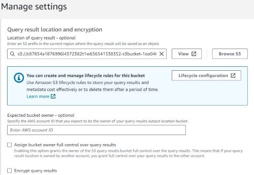 

4. Criar uma query em SQL 

 

5. Criar uma tabela usando o bucket criado no S3 para armazenar os resultados das consultas executadas no Athena      
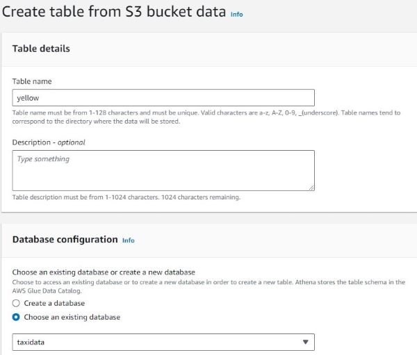 

6. Otimização do Banco de dados por meio do particionamento da tabela

- Criando uma tabela para testar a otimização

 

- Usando consulta para dados não divididos em buckets

 

- Usando consulta para dados divididos em buckets

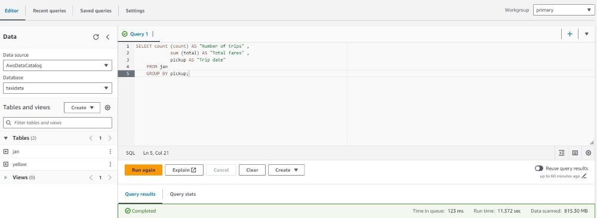 

7. Particionando os dados

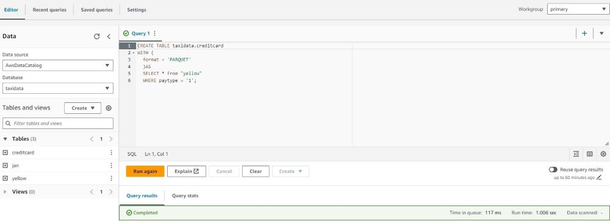 

8. Criar views no Athena com o objetivo de ocultar a complexidade das consultas e otimizar o desempenho

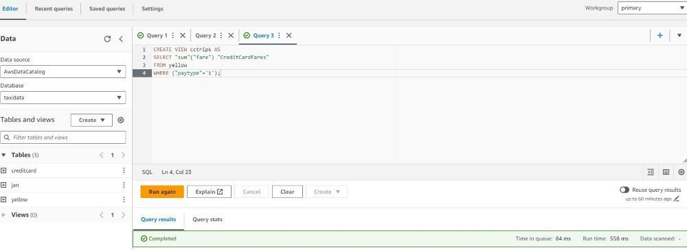 

- Juntando dados utilizando a View

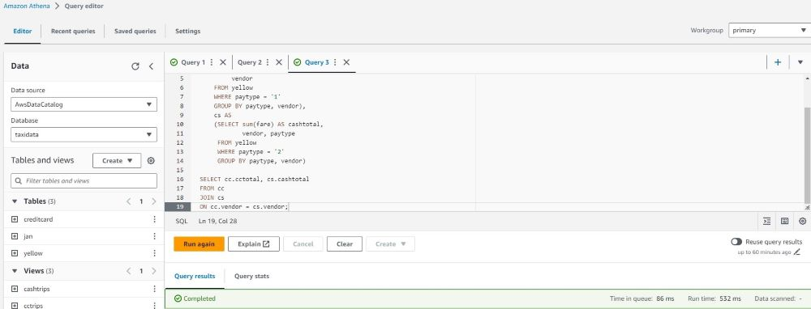 

### Lab 3: Query data in Amazon S3 with Amazon Athena and AWS Glue

**Serviços Utilizados**: Amazon Glue, S3

**Objetivo**: Acessar o AWS Glue via Console de Gerenciamento da AWS, criar um rastreador (crawler) e um banco de dados no AWS Glue, consultar dados do S3.

**Atividades realizadas**:

1. Acessando o AWS Glue e realizando as configurações inicias do rastreador

 

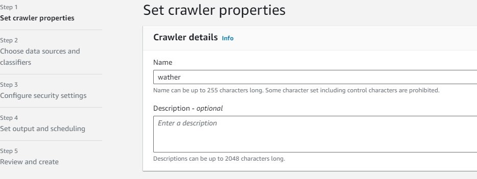 

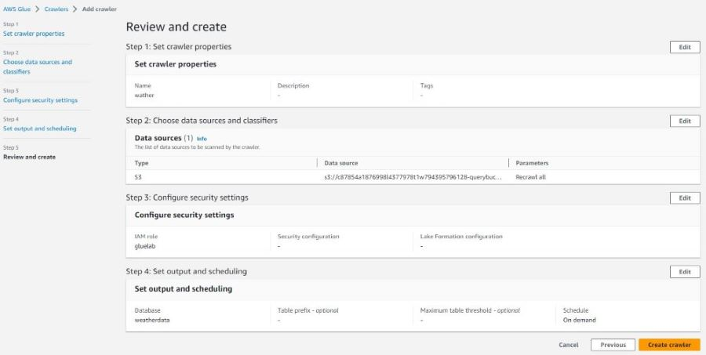 

2. Iniciando o rastreador

 

3. Revisando os metadados criados pelo AWS Glue

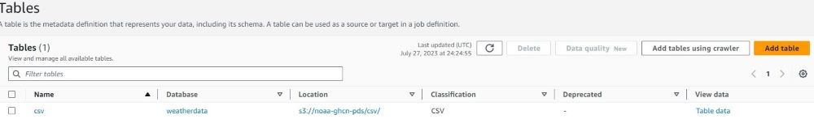 

4. Editando o schema criado

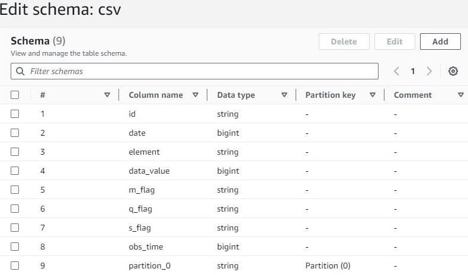 

5. Consultando a tabela usando o AWS Glue Data Catalog

 

6. Criando uma tabela 

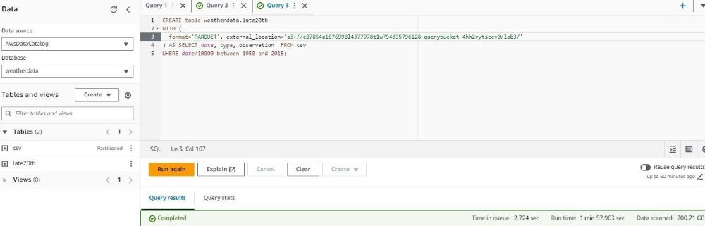 

7. Criando uma visão e executando uma consulta a partir dos dados selecionados

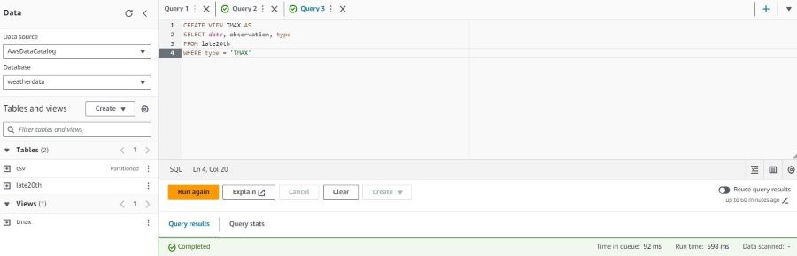 

8. Executando uma consulta

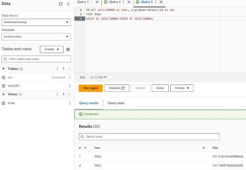 

# [Quais as principais lições apreendidas do curso?](#licoes-curso)

A realização do curso foi de extrema importância para minha formação na área de tecnologia, principalmente relacionada a minha área de atuação que se enquadra no contexto da ciência de dados. Essa experiência foi ainda mais enriquecedora para mim, uma vez que puder estar em contato com ferramentas tão importantes como as oferecidas pela AWS.

Algumas lições importante foram retiradas dessa experiência como a autonomia necessária para conclusão dos laborátorios,além dessa lição posso citar inúmeras outras como:

- Conhecimento das tecnologias da AWS
- Experiência com a análise de dados em nuvem
- Conhecimento relacionado ao processamento de dados em tempo real
- Conhecimento prático para integração entre os serviços AWS
