# Primeiros passos para implantação de uma aplicação na AWS

## Índice
- [Acesse a página do AWS Academy](#acessse-a-pagina-do-aws-academy)
- [Acessando a aba módulos](#acessse-a-aba-modulos)
- [Acessando o laboratório de aprendizagem](#acessse-laboratório-de-aprendizagem)
- [Acessando a lista de serviços](#acesssando-a-lista-servicos)
- [Iniciando a instância do serviço (EC2)](#iniciando-a-instancia-EC2)
- [Configurando o serviço de computação na nuvem (EC2)](#configurando-o-EC2)
- [Realizando a conexão com a instância criada](#conectando-se-a-instancia-criada)
- [Primeiro contato com o terminal da máquina criada](#hello-VM)
- [Inicinando um servidor HTTP simples](#inicinando-servidor-http-simples)

## [Acesse a página do AWS Academy](#acessse-a-pagina-do-aws-academy)

Acesse a pagina referente ao sistema de gerenciamento de aprendizagem (LMS) usado pela AWS Academy: `https://awsacademy.instructure.com/login/canvas`.
Essa é a pagina de login do **Canvas** que é destinadaao ao acesso ao ambiente de aprendizagem da AWS Academy. Realize seu login com usuário e senha, como mostra a imagem 1.

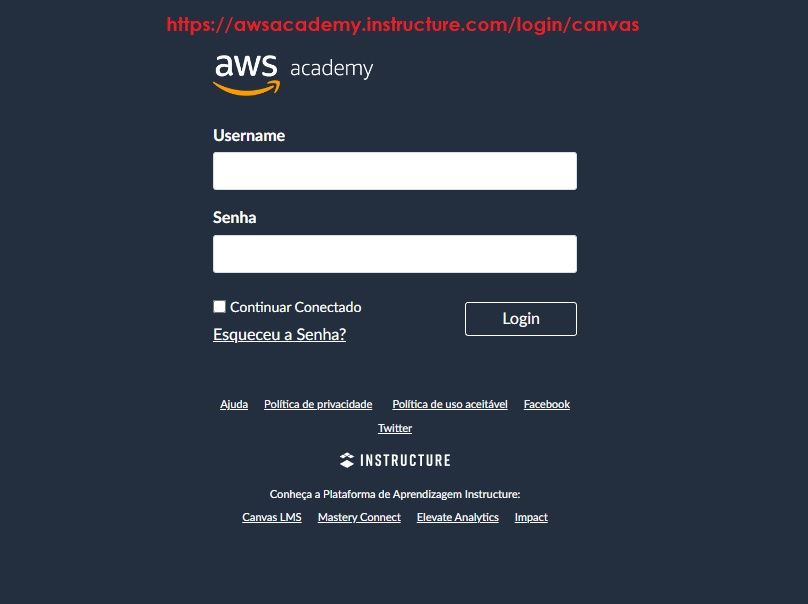

## Acessando a aba módulos

Após realizar o login, você estará na Home. Selecione a opção _Módulos_. Ao clicar nessa opção "Módulos", você terá acesso a uma lista de módulos de aprendizagem disponíveis. Esses módulos podem abranger diferentes tópicos relacionados à computação em nuvem, serviços da AWS, arquitetura de soluções, segurança, entre outros.

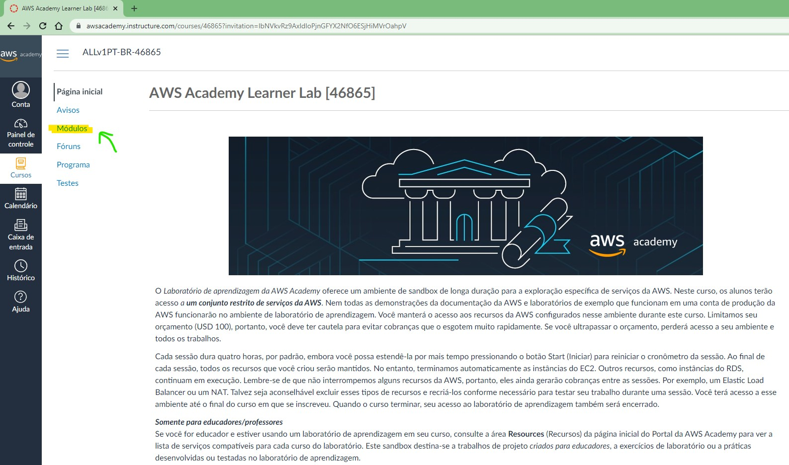

## Acessando o laboratório de aprendizagem

O laboratório de aprendizagem permitir que o usuário tenha acesso e possa participar dos laboratórios práticos relacionados aos cursos ou treinamentos oferecidos pela AWS Academy. 

Dentro dessa opção você encontrará uma série de recursos e atividades práticas para ajudar no aprendizado e na aplicação dos conceitos relacionados aos serviços da AWS. 

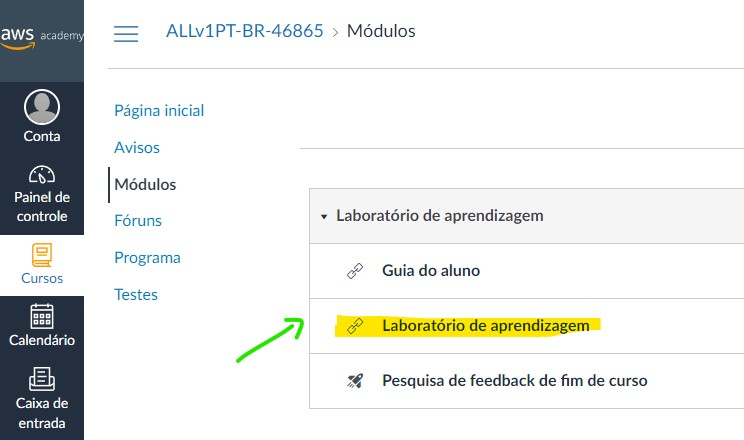

## Acessando o laboratório de aprendizagem

No laboratório de aprendizagem é possível perceber que existe uma opção chamada "AWS" (imagem abaixo) na lateral esquerda superior e no lado direto existe um menu de controle (Start Lab e End Lab).

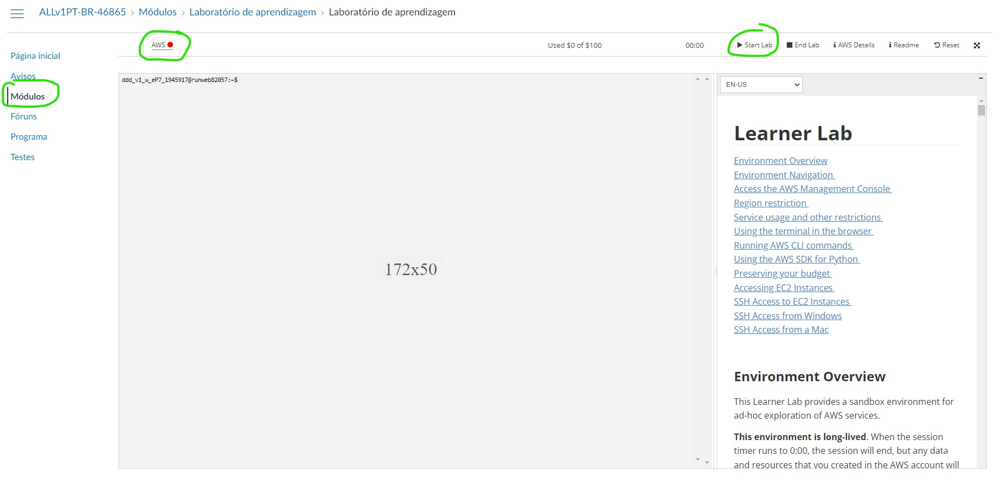

"AWS" refere-se à Amazon Web Services, a plataforma de serviços em nuvem da Amazon. Habilitando essa opção, ou seja mudando seu status de vermelho para verde, você pode acessar os serviços e recursos da AWS dentro do ambiente do laboratório. Isso permite que você experimente e trabalhe com os serviços da AWS de forma prática, aplicando os conceitos aprendidos nos módulos do curso. Para habilitar esses serviços é necessário selecionar a opção "Start Lab" para ligar os serviços. Em alguns segundo o icone de sinalização, vermelho mudará para verde como mostra a imagem abaixo.

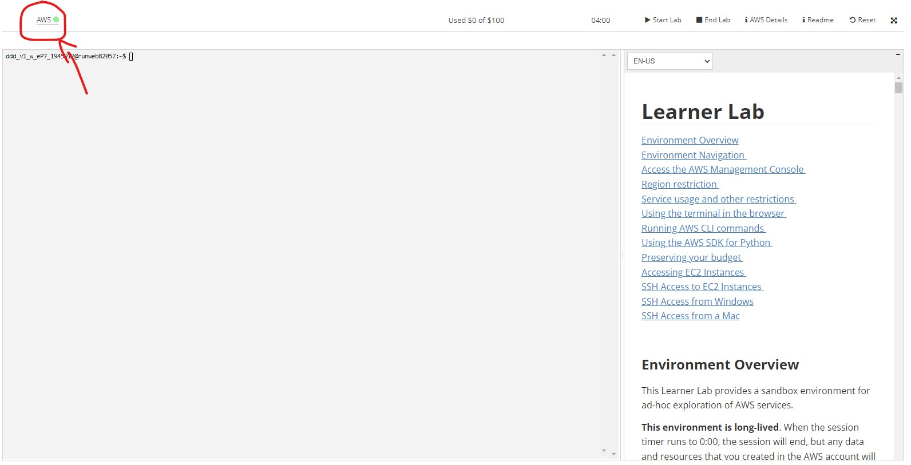

Quando o icone ficar verde siguinifica que agora os serviços podem ser utilizados. Para fazer isso clique na opção "AWS".

## Acessando a lista de serviços

Na tela que será aberta é possível visualizar todos os serviços que vc já utilizou. Para selecionar um novo serviço, selecione a opção "Ver todos os serviços". 

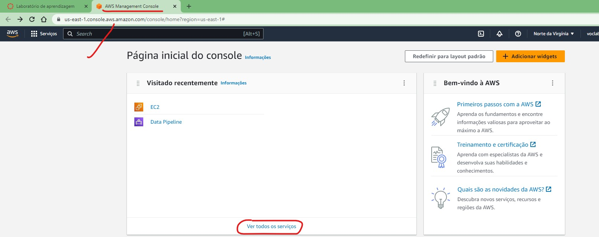

Será aberta uma lista com todos os serviços disponilizados pela AWS, como mostra a figura abaixo.

Nesse projeto estamos buscando usar o EC2 que é um serviço de computação em nuvem fornecido pela Amazon Web Services (AWS). 

O EC2 oferece capacidade de computação redimensionável na nuvem, permitindo que você provisione e gerencie facilmente máquinas virtuais (instâncias) de acordo com suas necessidades. Ele é é projetado para oferecer flexibilidade, escalabilidade e alta disponibilidade.Utilizando esse serviço é possível criar, iniciar, parar, gerenciar e encerrar instâncias sob demanda, fornecendo recursos computacionais de acordo com as necessidades do seu aplicativo ou projeto. Isso permite que você ajuste facilmente a capacidade de computação de acordo com a demanda, sem a necessidade de investir em hardware físico.

A seleção desse seviço pode ser feita escolhendo ele na lista entre os demais serviços mostrados.

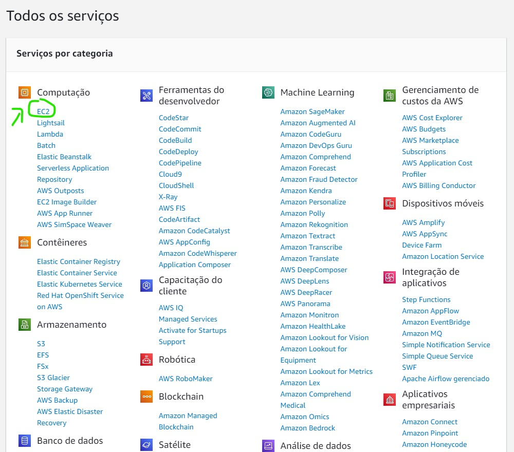

Uma vez selecionado o serviço será aberta a tela de configuração do mesmo.

## Iniciando a instância do serviço (EC2)

A etapa de instanciamento de um serviço, como o Amazon EC2, é de extrema importância antes de configurar o EC2 na AWS. Nessa etapa, você cria uma instância do EC2, que é a unidade fundamental de computação dentro desse serviço.

Ao criar uma instância do EC2, você está provisionando recursos computacionais na nuvem. Isso envolve a alocação de capacidade de processamento, memória, armazenamento e largura de banda necessários para executar seu aplicativo ou projeto. O instanciamento do serviço pode ser realizado selecionando a opção "Executar Instância", como mostra a imagem abaixo.

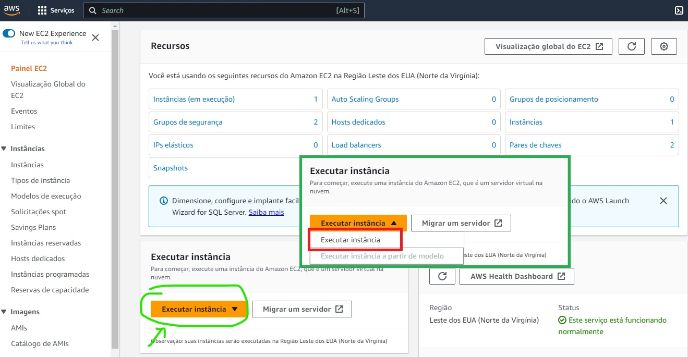

## Configurando o serviço de computação na nuvem (EC2)

Nessa etapa selecionaremos o sistema operacional que gostariamos de usar, realizaremos a configuração de rede e a criação de chaves para realização de conexão segura. As etapas descritas acima podem ser realizadas seguindo o passo a passo mostrados nas imagens abaixo:

- Escolhendo o sistema operacional (ubuntu)
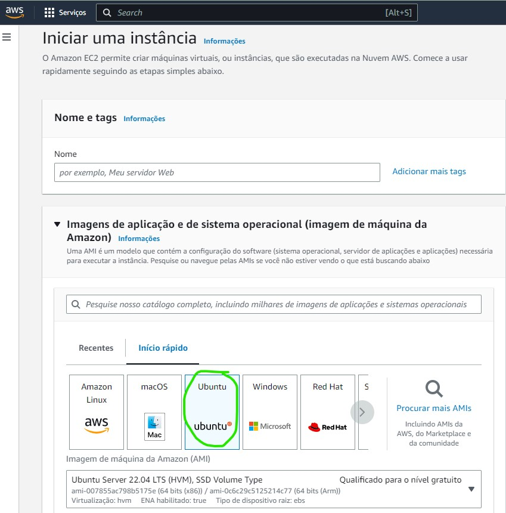

- Criando o par de chaves para conexão segura
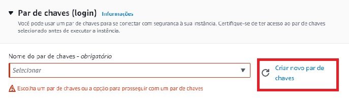

Na etapa da criação do par de chaves é importante escolher um nome que identifique essa conexão.
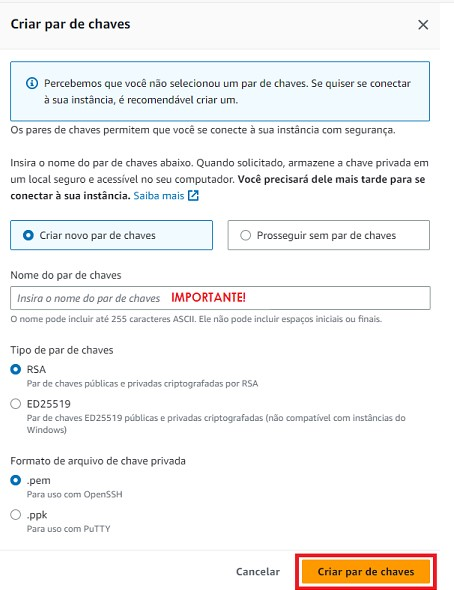

- Configurando a rede
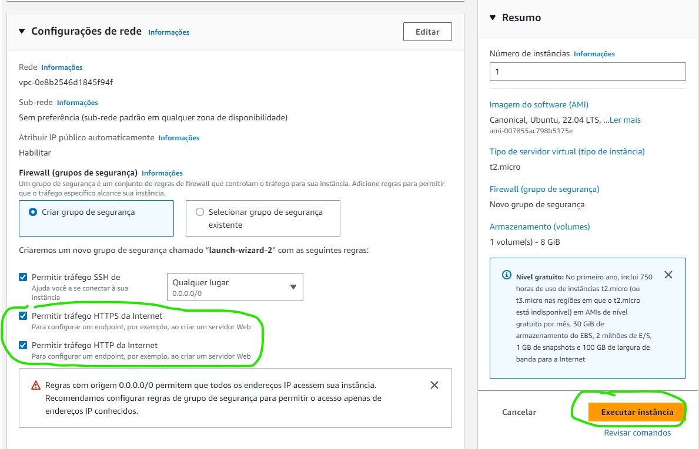

Finalizando as configurações, agora você pode finalizar essa etapa e seguir para a conexão selecionando a opção "Executar Instância".

## Realizando a conexão com a instância criada

Finalizando as configurações você será redirecionado para a tela de conexão com a instância.
Agora é possível realizar a conexão com a instância criada, selecionando a opção "Conectar-se a instância". 

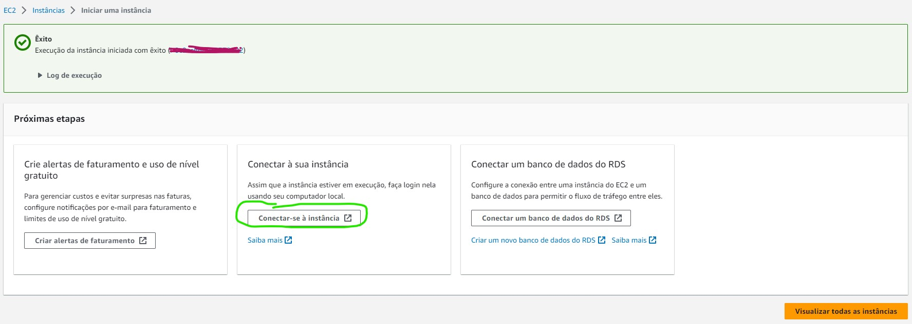

Abrirá a tela com algumas informações sobre a instância criada. Nessa tela você poderá verificar as configurações da mesma além de ser possível editar algumas opções como o próprio nome do usuário.

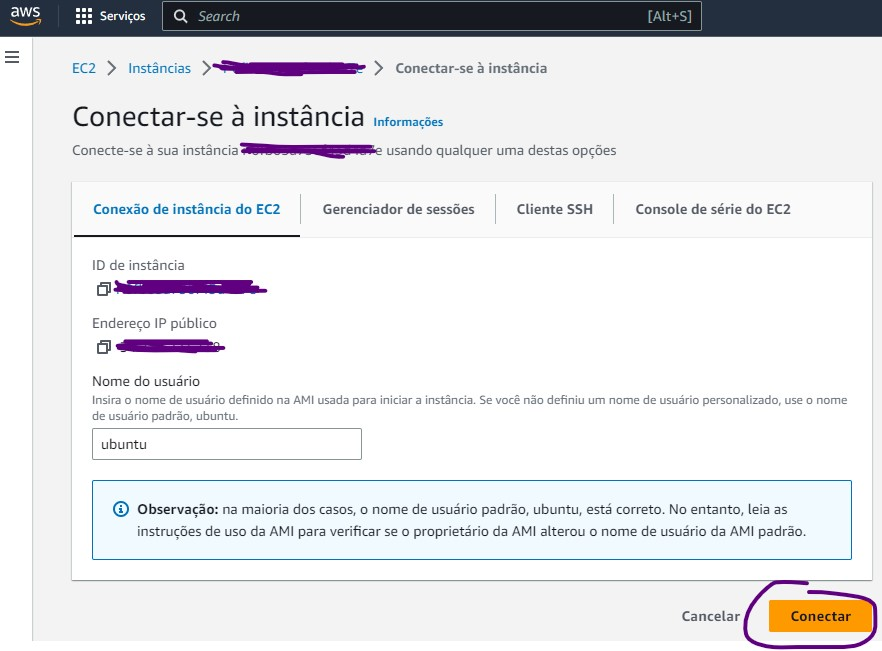

A opção "Conectar" te levará para a tela contendo o terminal de acesso a nova VM.

## Primeiro contato com o terminal da máquina criada

Pronto!
Tudo ocorreu com sucesso e agora você já estava vendo o terminal da sua máquina virtua na nuvem. 

Inicialmente confirmei as informações do sistema operacional, como mostra a imagem abaixo:

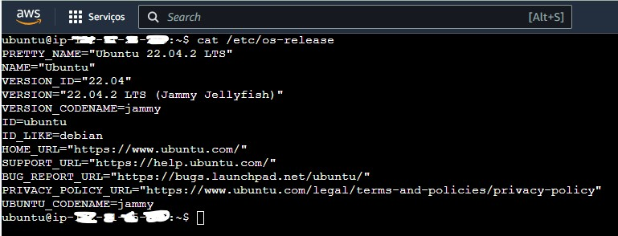

- ### Inicinando um servidor HTTP simples (local)

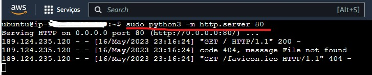

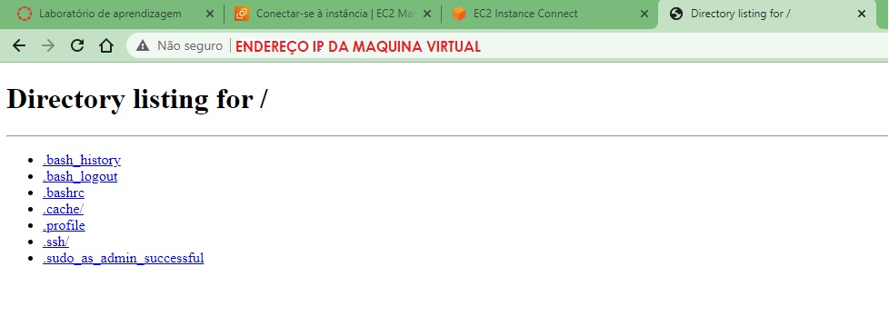

- ### Instalando o Docker.io e o NodeRed no Docker
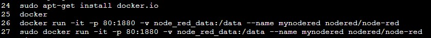

- #### Rondando o NodeRed no Docker
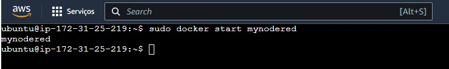
