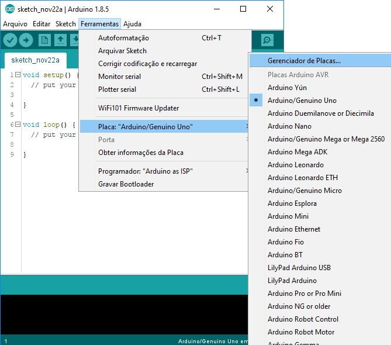

# Primeiros passos com o Node-Red e o NodeMCU

<a name="ancora"></a>
## Índice
- [Node-Red](#nodered)
    - [O que é o Node-Red?](#o_q_e_nodered)
    - [Como instalar o Node-Red via Docker?](#como_instalar_nodered_no_docker)
    - [Para que posso usar o Node-Red?](#para_q_posso_usar_nodered)
    - [O que são plugins e como utilizá-los?](#o_que_sao_plugins)
    - [Plugins utilizados nessa atividade](#plugins_utilizados_atividade)
- [NodeMCU e Arduino IDE](#nodemcu)
    - [Configurações iniciais do NodeMCU no Arduino IDE](#nodemcu-config)
- [Cenários Explorados](#cenarios-explorados)


<a id="nodered"></a>
# [Node-Red](#nodered)

Inicialmente começaremos essa leitura com o objetivo de entender o que é o Node-Red, após isso nos aprofundaremos nas usabilidade das suas ferramentas.

<a id="o_q_e_nodered"></a>
## [O que é o Node-Red?](#o_q_e_nodered)

O Node-RED é uma ferramenta de programação visual de código aberto que permite conectar dispositivos, APIs e serviços online de forma fácil e rápida. Ele utiliza uma interface baseada em navegador para criar fluxos de trabalho automatizados usando blocos de construção lógicos chamados "nós" (nodes) e conexões entre eles. 

Pode ser de grande ajuda consultar a documentação oficial da ferramenta, através desse [link](https://nodered.org/).

<a id="como_instalar_nodered_no_docker"></a>
## [Como instalar o Node-Red do Ubuntu com Docker?](#como_instalar_nodered_no_docker)

Para instalar o Node-Red do Ubuntu usando o docker, siga os passos abaixo:

1. Certifique-se de ter o Docker instalado em seu sistema digitando o comando `docker -v` na linha de comando.

2. Usando linha de comando execute o código para baixar e iniciar um contêiner Docker com o Node-RED:

```bash
docker run -it -p 1880:80 --name mynodered nodered/node-red
```

O comando acima realizará o download da imagem do Node-RED do Docker Hub e iniciará um contêiner chamado **"mynodered"**. A opção `-p 80:1880` mapeia a porta _1880_ do contêiner para a porta _80_ do seu sistema, permitindo que você acesse o Node-RED através do navegador no endereço `http://localhost` ou `ip_da_maquina`.

O Node-RED agora está instalado e em execução dentro de um contêiner Docker.

3. Após a instalação é possível utilizar os comandos: 

``sudo docker stop mynodered`` para para a execução e reiniciá-lo com ``sudo docker start mynodered ``sempre que desejar.

A documentação oficial do Node-Red também mostra como a instalação via docker pode ser realizada, neste [link](https://nodered.org/docs/getting-started/docker).


<a id="para_q_posso_usar_nodered"></a>
## [Para que posso usar o Node-Red?](#para_q_posso_usar_nodered)


A flexibilidade do Node-Red juntamente com o incontável número de cenários aos quais ele pode ser utilizado dentro do mundo de criação de aplicações torna esse ferramente muito poderosa.

Algumas das situações em que ela pode ser utilizada foram descritas abaixo:

- Automação residencial: O Node-RED possibilita a criação de fluxos para automatizar tarefas em sua casa inteligente, como controlar iluminação, termostatos, câmeras de segurança, sistemas de irrigação e muito mais. Os nós e plugins disponíveis facilitam a integração com dispositivos e serviços populares.

- Internet das Coisas (IoT): O Node-RED é amplamente utilizado na IoT devido à sua facilidade de uso e suporte nativo para protocolos de comunicação, como MQTT. Você pode conectar dispositivos IoT, coletar e processar dados de sensores, controlar atuadores e criar soluções de monitoramento e automação.

- Integração de serviços e APIs: O Node-RED simplifica a integração de diferentes serviços e APIs. Por meio dos nós e plugins disponíveis, você pode conectar-se a serviços populares, como Twitter, Facebook, Google Cloud, AWS, entre outros. Isso permite criar fluxos automatizados para coletar, processar e enviar dados entre esses serviços.

- Processamento e análise de dados: Com a capacidade de criar fluxos visuais e interconectar nós de processamento de dados, o Node-RED é útil para realizar tarefas de transformação, filtragem e análise de dados. Ele permite que você colete dados de diferentes fontes, aplique lógica personalizada e visualize resultados.

- Desenvolvimento rápido de protótipos: O Node-RED é uma ferramenta ideal para prototipagem rápida de projetos. Sua interface visual permite criar fluxos complexos sem escrever muito código. Isso acelera o processo de desenvolvimento, permite testar ideias rapidamente e facilita a iteração e aperfeiçoamento dos fluxos.

- Monitoramento e controle remoto: O Node-RED pode ser usado para criar painéis de controle personalizados, onde você pode monitorar e controlar dispositivos e sistemas em tempo real. Com o plugin Dashboard, é possível criar interfaces gráficas interativas para visualização de dados e controle de dispositivos.

<a id="o_que_sao_plugins"></a>
## [O que são plugins e como utilizá-los?](#o_que_sao_plugins)

Os plugins do Node-RED, também chamados de "nodes" ou "pacotes", são extensões de software que fornecem funcionalidades adicionais ao ambiente do Node-RED. Eles são desenvolvidos por terceiros e podem ser instalados para estender as capacidades do Node-RED.

Existem plugins para integração com serviços de mensagens, como o Telegram ou o MQTT, que permitem enviar e receber mensagens por meio desses serviços. Há também plugins para interagir com bancos de dados, realizar análises de dados, controlar dispositivos IoT, enviar notificações, entre outros.

A instalação dos plugins pode ser realizada seguindo os passos abaixo:

1. Abra o Node-Red via navegador.

2. Clique no botão de menu no canto superior direito da interface (ícone com três linhas horizontais) e escolha a opção **"Manage palette"**. 

3. Na janela que se abrirá, você verá duas guias: "Installed" (Instalados) e "Available" (Disponíveis).
Na guia "Available" (Disponíveis), você encontrará uma lista de todos os plugins disponíveis para instalação. Você pode pesquisar por nome ou explorar as categorias.

4. Encontre o plugin desejado e clique no botão "Install" (Instalar) ao lado dele. Aguarde até que a instalação seja concluída. O Node-RED baixará e instalará automaticamente o plugin.

5. Após a instalação, você encontrará os nós do novo plugin na paleta de blocos do Node-RED, organizados por categoria.

<a id="plugins_utilizados_atividade"></a>
## [Plugins utilizados nessa atividade](#plugins_utilizados_atividade)


- Telegram - "node-red-contrib-telegrambot":

O plugin do telegram para o Node-RED que permite a integração com o serviço de mensagens Telegram. Com ele você pode criar fluxos no Node-RED para enviar e receber mensagens através do Telegram.

A utilização do plugin "node-red-contrib-telegrambot" é ampla e pode ser aplicada em diferentes cenários. Por exemplo, você pode configurar um fluxo que envia notificações para o Telegram quando ocorre um evento específico, como a detecção de movimento em uma câmera de segurança. 
Além disso, é possível criar fluxos que respondem a comandos recebidos no Telegram, permitindo interações e controle remoto de dispositivos conectados ao Node-RED.

Exemplo de utilização da documentação pode ser acessado nesse (link)[https://flows.nodered.org/node/node-red-contrib-telegrambot]

- MQTT - "node-red-contrib-mqtt-broker":

O plugin "node-red-contrib-mqtt-broker" é um dos plugins disponíveis para o Node-RED que fornece uma implementação de um broker MQTT embutido. 

Um broker MQTT é um servidor que permite a troca de mensagens usando o protocolo MQTT entre os dispositivos conectados a ele. Esse plugin permitir que você crie seu próprio broker MQTT dentro do Node-RED, simplificando a configuração e a comunicação MQTT em seus fluxos. 

Isso permite a troca de mensagens entre dispositivos conectados usando o protocolo MQTT, facilitando a integração de dispositivos IoT e serviços que se comunicam por meio desse protocolo.
 
Exemplo de utilização da documentação pode ser acessado nesse (link)[https://cookbook.nodered.org/mqtt/connect-to-broker]


- Dashboard - "node-red-dashboard":

Esse plugin é uma extensão do Node-RED que permite criar painéis interativos personalizados para visualização de dados e controle de dispositivos em tempo real. Com esse plugin, é possível criar interfaces gráficas amigáveis no Node-RED, sem a necessidade de conhecimentos avançados em desenvolvimento web.


Exemplo de utilização da documentação pode ser acessado nesse (link)[https://flows.nodered.org/node/node-red-dashboard]


<a id="nodemcu"></a>
# [NodeMCU](#nodemcu)

O NodeMCU é uma plataforma de desenvolvimento de Internet das Coisas (IoT) baseada no microcontrolador ESP8266. Ele combina a facilidade de uso do NodeMCU firmware com o poder do ESP8266, permitindo criar projetos IoT de maneira rápida e eficiente.

A utilização do NodeMCU é ampla e versátil. Com sua conectividade Wi-Fi embutida e capacidade de programação, você pode usá-lo para criar uma variedade de dispositivos IoT, como sensores, controladores, módulos de comunicação e muito mais.

Com o NodeMCU, você pode coletar dados de sensores e enviá-los para a nuvem, controlar dispositivos remotamente por meio de uma interface web ou aplicativo móvel, criar sistemas de automação residencial, construir protótipos de projetos IoT e muito mais. Uma das principais vantagens do NodeMCU é a sua compatibilidade com a plataforma Arduino, o que permite aproveitar a vasta quantidade de bibliotecas e exemplos disponíveis para o Arduino. 

<a id="nodemcu-config"></a>
## [Configurações iniciais do NodeMCU no Arduino IDE](#nodemcu-config)
Após conectar o NodeMCU a porta USB do computador é necessário realizar as configurações na IDE Arduino(software).

O passo a passo dessa configuração pode ser acompanhado resumidamente abaixo:
1. Abra a IDE do Arduino e navegue até a Arquivo -> Preferências.


Procure pelo campo URLs adicionais de Gerenciadores de Placas e insira o link: `http://arduino.esp8266.com/stable/package_esp8266com_index.json`

O resultado deve ser o seguinte:


2. Agora clique em Ferramentas -> Placa -> Gerenciador de Placas:



3. Baixe a biblioteca ESP8266:
Busque pela opção esp8266 by ESP8266 Community e clique no botão Instalar.


Confira se sua placa está disponível em Ferramentas -> Placa:


4. Baixe e instale a biblioteca PubSubClient em Ferramentas -> Gerênciar Biblioteca:


Agora está tudo pronto para iniciarmos o projeto.

O código utilizado nesse exemplo para a comunicação entre o NodeMCU via MQTT, pode ser encontrado [aqui](../codigos/codigos/mqtt_ardunino.ino).

- OBS: Fique atento a qual porta USB o NodeMCU foi conectado e na IDE escolha ela como sendo a porta de comunicação no menu Ferramentas -> Porta.

<a id="cenarios-explorados"></a>
# [Cenários Explorados](#cenarios-explorados)

Nessa atividade foram explorados 3 cenários principais, descritos abaixo:

## 1. Comunicação do NodeMCU com MQTT:

Nesse cenário, o NodeMCU foi conectado na porta USB do computador usando a COM12. Uma vez conectado e realizadas as configurações de senha, rede wifi, servidor broker e o tópico do canal, basta abrir o terminal da IDE e esperar o status da conexão.

Essas configurações podem ser acompanhadas diretamente no (código)[../codigos/codigos/mqtt_ardunino.ino], nesse caso foi utilizado o canal "teste1".

A comunicação foi testada através do acendimento do led do NodeMCU.
Com o MQTT dashboard instalado no celular (verifique esse procedimento nesse [aqui](./mqtt_dashboard_apk.md)), criei um novo canal utilizando o mesmo tópico inserido no código (teste1).

Enviando a palavra ligar via canal teste1, o led acende e fica assim por 3segundos. Nesse processo ele envia uma mensagem para o tópico "status" informando o status do led. Após o tempo determinado ele apaga, o procedimento de apagar o led funciona da mesma maneira, uma mensagem desligar é enviada via canal teste1, e sua resposta é publicada no canal status.

## 2. Comunicação do NodeMCU via MQTT com o Node-red e recebe comandos do Dashboard:

Para esse cenário foi necessário instalar o plugin do dashboard no Node-RED, seguindo os passos abaixo:

Acesse o Menu de Opções localizado no canto superior direito selecione a opção Manage pallete:


Na aba de plugins Install digite dashboard e instale o plugin chamado node-red-dashboard.


Com o plugin instalado já será possivel notar os novos blocos referentes ao dashboard presentes na tela principal. Usaremos o button e o text. 

A configuração dos blocos pode ser observada na imagem abaixo:


Essa estrutura permitirá enviarmos uma mensagem via dashboard apertando o button, essa mensagem será encaminhada para o NodeMCU via mqtt, a resposta enviada pelo NodeMCU, publicada no canal status será visualizada no dashboard via o bloco text, além de poder ser visualizada via debug console no Node-RED por estarmos usando o bloco de debug.

Uma outra configuração que também foi testada foi a apresentada abaixo:


Nessa opção temos dois blocos de Debug que permitem visualizar no Node-Red tanto o envio como o recebimento da mensagem.

## 3.Comunicação do NodeMCU via MQTT com um rede social (Ex: Telegram).

O procedimento para instalação do plugin também deve ser repetido para essa situação. O plugin instalado aqui foi "node-red-contrib-telegrambot".

Após a instalação os blocos referentes ao telegram já poderão ser vistos na tela principal. Foram usados apenas o telegram sender e receiver. 

Para essa comunicação é importante termos o ID do chat e token do bot criado no telegram. Essas configurações são pedidas nos blocos citados acima.

A configuração final do cenário é representada na imagem abaixo:
É interessante observar que existem 3 blocos mqtt server,isso ocorre pois nesse exemplo eu testei 3 canais com tópicos diferentes para recebimento das mensagens publicadas como resposta pelo mqtt.

